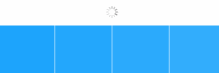

<p align="center">
  <a href=#>
    
  </a>

  <h3 align="center">KafkaRefresh</h3> 
  <p align="center">
     内置多种动画、可自定义和灵活的iOS下拉刷新框架。
    <br> 
    <br>
    <a href="https://github.com/xorshine/KafkaRefresh/issues/new?template=bug_cn.md">Bug提交</a>
    ·
    <a href="https://github.com/xorshine/KafkaRefresh/issues/new?">需求提交</a>  
  </p>
</p> 
<br>

### Status

[](https://github.com/xorshine/KafkaRefresh/blob/master/LICENSE)
[](https://img.shields.io/cocoapods/v/KafkaRefresh.svg)

 
[](mailto:xorshine@icloud.com)

### Screenshots
<table>
<tr height="60px" align="center">
  <td width="20%"><strong>KafkaRefreshStyle</strong></td>
  <td width="40%"><strong>Top Screenshots</strong></td>
  <td width="40%"><strong>Bottom Screenshots</strong></td>
</tr>
<tr align="center" height="120px">
  <td width="300px">Native</td>
  <td></img></td>
  <td></img></td>
</tr>
<tr align="center" height="120px">
  <td>ReplicatorWoody</td>
  <td></img></td>
  <td></img></td>
</tr>
<tr align="center" height="120px">
  <td>ReplicatorAllen</td>
  <td></img></td>
  <td></img></td>
</tr>
<tr align="center" height="120px">
  <td>ReplicatorCircle</td>
  <td></img></td>
  <td></img></td>
</tr>
<tr align="center" height="120px">
  <td>ReplicatorDot</td>
  <td></img></td>
  <td></img></td>
</tr>
<tr align="center" height="120px">
  <td>ReplicatorArc</td>
  <td></img></td>
  <td></img></td>
</tr>
<tr align="center" height="120px">
  <td>ReplicatorTriangle</td>
  <td></img></td>
  <td></img></td>
</tr>
<tr align="center" height="120px">
  <td>AnimatableRing</td>
  <td></img></td>
  <td></img></td>
</tr>
<tr align="center" height="120px">
  <td>AnimatableArrow</td>
  <td></img></td>
  <td></img></td>
</tr>
</table> 

### 关于新版2.0
* 开源KafkaRefresh纯属自娱自乐。那时较闲。KafkaRefresh有很大不足，如：更细粒度的视觉动画、更规范的API命名、支持Swift、支持更多的自定义...等等。无奈的是，手头事情之多，使之暂无闲心更新2.0。怕是要很久之后吧。

* 有人问为何要以Kafka命名，Apache基金会开源过一款分布式消息系统也叫做Kafka，KafkaRefresh跟Apache Kafka没任何关系。当时不知道，即使知道，还是会叫KafkaRefresh。其实是个人喜欢的一个作家叫Kafka，KafkaRefresh的内置样式也用了一些我喜欢的人的名字命名，这没什么意义，或许是为了当时的方便罢了。

### 特点
* 支持多样式选择与自定义

> 内置9种动画样式

* 非刷新状态自动隐藏

> 即使手动调整过contentInset，依然能够在非刷新状态自动隐藏影。最常见的情况是：当数据量过少，UITableView停止刷新后，用户依旧能看到刷新控件的存在，从而影响的视觉体验。KafkaRefresh首次解决了该问题。

* 刷新结束时抗抖动

> 当UIScrollView处于刷新状态，且用户滑动UIScrollView，当刷新结束时，KafkaRefresh不会调整UIScrollView的内容，从而导致页面跳动；

* 支持设置控件高度

> `stretchOffsetYAxisThreshold`是根据刷新控件的高度进行的比例调整。如：当设置`stretchOffsetYAxisThreshold`为1.5时，触发刷新的偏移距离将调整为原来的1.5倍。

* 支持全局配置

> `KafkaRefreshDefaults`类似一个配置表，通过该配置表配置全局的刷新样式，而无需在每一个页面初始化或者绑定刷新控件。

* 支持进度回调

> 实时回调拖拽的偏移比例，对于扩展接口，可根据进度调整动画。该接口的开放可用于扩展更多的刷新东亚样式。

* 自适应contentInset系统调整与手动调整

> 自适应iOS7以后UINavigationController自动调整scrollview contentOffset，KafkaRefresh也对iOS 11进行了适配；当您手动设置了contentInset的值，也无需担心KafkaRefresh会影响到视觉效果。

* 解决刷新状态分组视图悬停问题

> 即使在列表滑动时，分组视图都将跟随ScrollView滑动（即使处于高速滑动状态下！）。

* 支持预加载

  当用户滑动scrollview接近至底部时，将会自动触发刷新，无需用户再滑至底部后拉起scrollview。该功能默认不开启，因为多数人不查看文档便欣然使用改功能，不正确使用极容易引发刷新无法停止。

  使用预加载功能，请严格按照下面要求使用:

  * ```self.tableView.footRefreshControl.autoRefreshOnFoot = YES;``` 请手动将刷新该属性至为TRUE；

  * 在刷新调用的block块中，严格按下列逻辑编写：

    ```objective-c
     if (没有数据需要拼接了) {
         [weakSelf.tableView.footRefreshControl endRefreshingAndNoLongerRefreshingWithAlertText:@"no more"];
     } else {
         [weakSelf.tableView.footRefreshControl endRefreshingWithAlertText:@"Did load successfully" completion:nil];
     }
    ```

* 文档覆盖率100%、支持横竖屏切换自适应、iOS 7+。


### 安装
* CocoaPods
```ruby
pod 'KafkaRefresh'
```

* Carthage 

>  如果您想通过*carthage*安装 , 请您申请一个pull request.

### 使用

##### 1.引入头文件
```objective-c
 #import "KafkaRefresh.h" 
```

##### 2.初始化控件
* 方式一
```objective-c
#pragma mark - head

[self.tableView bindHeadRefreshHandler:^{
        
    } themeColor:MainColor refreshStyle:KafkaRefreshStyleAnimatableArrow];

#pragma mark - foot

[self.tableView bindFootRefreshHandler:^{
        
    } themeColor:MainColor refreshStyle:KafkaRefreshStyleAnimatableArrow]; 

#pragma mark - auto refresh

self.tableView.footRefreshControl.autoRefreshOnFoot = YES;
```
* 方式二
```objective-c
 KafkaArrowHeader * arrow = [[KafkaArrowHeader alloc] init];
 arrow.refreshHandler = ^{
	 //.....
 };
 self.tableView.headRefreshControl = arrow;
```

* 方式三 全局配置
```objective-c
- (BOOL)application:(UIApplication *)application didFinishLaunchingWithOptions:(NSDictionary *)launchOptions 
{
	[[KafkaRefreshDefaults standardRefreshDefaults] setHeaderDefaultStyle:KafkaRefreshStyleAnimatableRing];
	return YES;
}

#pragma mark - global

[self.tableView bindGlobalStyleForFootRefreshHandler:^{
        
}];

```
##### 3.手动触发刷新
```objective-c
 [self.tableView.headRefreshControl beginRefreshing];
 [self.tableView.footRefreshControl beginRefreshing];
```

##### 4.结束刷新
```objective-c

/*
	一般方式结束刷新
*/
- (void)endRefreshing;
 
/*
	结束刷新且需要提示文字
*/
- (void)endRefreshingWithAlertText:(NSString *)text completion:(dispatch_block_t)completion;

/*
	结束刷新且不再需要刷新功能
*/
- (void)endRefreshingAndNoLongerRefreshingWithAlertText:(NSString *)text;
```

##### 5.重新恢复刷新

```objective-c
/**
 当调用过 ‘endRefreshingAndNoLongerRefreshingWithAlertText’,
 且重新需要恢复刷新功能室，调用下面方法
 */
- (void)resumeRefreshAvailable;
```

### 自定义

以KafkaheadRefreshControl为例：
```objective-c
 #import "KafkaheadRefreshControl.h"
 @interface CustomHeader : KafkafootRefreshControl
 @end
```
 ```objective-c
 @implementation CustomHeader 
 
- (void)setupProperties
{
	[super setupProperties];
	//初始化属性
}
 
- (void)kafkaDidScrollWithProgress:(CGFloat)progress max:(const CGFloat)max
{
	//进度回调
}

- (void)kafkaRefreshStateDidChange:(KafkaRefreshState)state
{
	[super kafkaRefreshStateDidChange:state];
}
 @end
 ```

### FAQ

* 遇到很多人咨询这样一个问题：上拉加载数据时，调用 `insertRowsAtIndexPaths: withAnimation:`拼接数据，发现tableView刷新过程发生抖动，位置发生偏移。首先申明！这不是KafkaRefresh的原因。如果想要解决这个问题，请设置`tableView.estimatedRowHeight = UITableViewAutomaticDimension;`.
* 关于Bug的提交，请您一定要记住！应该提交基本信息！当前版本号，重现步骤（请不要过于相信您的中文能力，您写一句话我未必能看懂。）

### 交流

> 1. 如需要帮助，请邮件 <xorshine@icloud.com> 
> 2. 个人精力有限，KafkaRefresh开放的接口足够去扩展更丰富的UI效果，欢迎您参与，并提交pull request

### 协议
> KafkaRefresh采用MIT开源协议。
