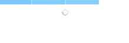
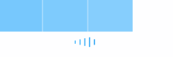
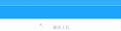

[](https://github.com/xorshine/KafkaRefresh)
[](https://github.com/xorshine/KafkaRefresh/blob/master/LICENSE)
[](https://img.shields.io/cocoapods/v/KafkaRefresh.svg)

 
[](mailto:xorshine@icloud.com)

### Screenshots
<table>
<tr height="60px" align="center">
  <td width="20%"><strong>KafkaRefreshStyle</strong></td>
  <td width="40%"><strong>Top Screenshots</strong></td>
  <td width="40%"><strong>Bottom Screenshots</strong></td>
</tr>
<tr align="center" height="120px">
  <td width="300px">Native</td>
  <td></img></td>
  <td></img></td>
</tr>
<tr align="center" height="120px">
  <td>ReplicatorWoody</td>
  <td></img></td>
  <td></img></td>
</tr>
<tr align="center" height="120px">
  <td>ReplicatorAllen</td>
  <td></img></td>
  <td></img></td>
</tr>
<tr align="center" height="120px">
  <td>ReplicatorCircle</td>
  <td></img></td>
  <td></img></td>
</tr>
<tr align="center" height="120px">
  <td>ReplicatorDot</td>
  <td></img></td>
  <td></img></td>
</tr>
<tr align="center" height="120px">
  <td>ReplicatorArc</td>
  <td></img></td>
  <td></img></td>
</tr>
<tr align="center" height="120px">
  <td>ReplicatorTriangle</td>
  <td></img></td>
  <td></img></td>
</tr>
<tr align="center" height="120px">
  <td>AnimatableRing</td>
  <td></img></td>
  <td></img></td>
</tr>
<tr align="center" height="120px">
  <td>AnimatableArrow</td>
  <td></img></td>
  <td></img></td>
</tr>
</table>

### <a id="inchinese"></a>概述
高度可扩展、自定义、多样式的刷新框架。

### 比较
以下的比较结果，不代表对这些开源库的评价而去突出KafkaRefresh的优秀。EGO是最早的刷新开源库，奠定了基础，给后来的开源库提供了很好的思路。MJRefresh则是第一个进行完整的系统适配。而在MJRefresh之前，刷新库是需要对其进行一定的修改才能满足日常开发需要。在此对这些优秀的开源库作者表示敬意。

<table>
<tr height="45px" align="center">
  <td width="20%"><strong></strong></td>
   
  <td width="20%"><a href="https://github.com/enormego/EGOTableViewPullRefresh"><strong>EGOTableViewPullRefresh</strong></a></td>
  
  <td width="20%"><a href="https://github.com/samvermette/SVPullToRefresh"><strong>SVPullToRefresh</strong></a></td>
  
  <td width="20%"><a href="https://github.com/CoderMJLee/MJRefresh"><strong> MJRefresh</strong></a></td>
  
   <td width="20%"><a href="##"><strong> KafkaRefresh</strong></a></td>
  
</tr>
<tr align="center" height="45px">
  <td width="20%"><strong>多种样式选择</strong></td>
  <td width="20%"></img></td>
  <td width="20%"></img></td>
  <td width="20%"></img></td>
  <td width="20%"></img></td> 
</tr>
<tr align="center" height="45px">
  <td><strong>刷新中允许交互</strong></td>
  <td></td>
  <td></td>
  <td></img></td>
  <td></img></td> 
</tr>
<tr align="center" height="45px">
  <td><strong>持续维护</strong></td>
  <td></img></td>
  <td></img></td>
  <td></img></td>
  <td></img></td>
</tr>
<tr align="center" height="45px">
  <td><strong>进度回调</strong></td>
  <td></img></td>
  <td></img></td>
  <td></img></td>
  <td></img></td>
</tr>
</table>

### 特点
<table>
<tr align="center" height="60px"> 
  <td width="30%"><strong>特点</strong></td>
  <td width="70%"><strong>描述</strong></td> 
</tr>
<tr align="center" height="60px"> 
  <td><strong>支持多样式选择与自定义</strong></td>
  <td align="left"><font color=gray size=2>
  KafkaRefresh内置多种刷新样式，且可对样式进行自定义。扩展接口可让开发者集成更多丰富的UI效果。
  </font></td> 
</tr>
<tr align="center" height="60px"> 
  <td><strong>非刷新状态自动隐藏</strong></td>
  <td align="left">
  <font color=gray size=2>
  能避免开发者手动调整contentInset后刷新控件的出现而影响视觉体验；最常见的情况时，不存在数据时，底部的刷新的控件未隐藏，使用KafkaRefresh能避免该问题。</font>
  </td> 
</tr>
<tr align="center" height="60px"> 
  <td><strong>刷新结束时滑动抗抖动</strong></td>
  <td align="left">
  <font color=gray size=2>
  当控件结束刷新，UIScrollView如果处于滑动状态，KafkaRefresh将根据刷新控件此时是否显示控制UIScrollView的contntOffset.</font>
  </td> 
</tr>
<tr align="center" height="60px"> 
  <td><strong>支持抗内容偏移的滚动刷新</strong></td>
  <td align="left"><font color=gray size=2>
一般的，我们在使用UITableView，特别是UITableView需要用到下拉刷新功能时，我们很少设置SectionHeader。不幸的是，如果使用了SectionHeader，且集成了UIRefreshControl或者其他第三方库，那么刷新的效果将会很难看。原因是SectionHeader将会跟随contentInset的变化而变化。著名的刷新库MJRefresh在处理这个情况时，将ScrollView手动滚动到最顶部，这样可以解决SectionHeader悬空的问题。但如果你的UITableView使用了预处理或者预加载技术，那么这样的处理显然不够。KafkaRefresh处理该情况时，根据刷新控件当前的位置进行判断，如果用户下拉的距离超过刷新控件的高度，且此时刷新控件依旧不能出现在屏幕上时，则认为此时只需要处理刷新逻辑，而无需出现任何的刷新效果（不改变contentInset和contentOffset），即使在刷新中，如果用户突然滑倒最顶端，将会动态改变contentInset的数值，用户依然能看到刷新效果，这样处理在数据的预加载技术中表现很友好。</font></td> 
</tr>
<tr align="center" height="60px"> 
  <td><strong>支持设置触发刷新的偏移阀值</strong></td>
  <td align="left">
  <font color=gray size=2>
  偏移阀值可自定义，自我把控触发刷新的条件；偏移阀值是基于控件高度的倍数，且必须大于1.0；否则无效。
  </font></td> 
</tr>
<tr align="center" height="60px"> 
  <td><strong>支持全局配置</strong></td>
  <td align="left"><font color=gray size=2>KafkaRefreshDefaults支持全局设置样式</font></td> 
</tr>
<tr align="center" height="60px"> 
  <td><strong>支持进度回调</strong></td>
  <td align="left"><font color=gray size=2>实时回调拖拽的偏移比例，对于扩展接口，可根据进度调整动画</font></td> 
</tr>
<tr align="center" height="60px"> 
  <td><strong>自适应contentInset系统调整与手动调整</strong></td>
  <td align="left"><font color=gray size=2>
  自适应iOS7以后UINavigationController自动调整scrollview contentOffset，KafkaRefresh也对iOS 11进行了适配；当您手动设置了contentInset的值，也无需担心KafkaRefresh会影响到视觉效果。</font>
  </td> 
</tr>
<tr align="center" height="60px"> 
  <td><strong>解决刷新状态分组视图悬停问题</strong></td>
  <td align="left"><font color=gray size=2>
  当UITableView优多个分组，且分组视图的高度非0时，刷新状态将出现半空悬停的效果。从EGO以来，尝试解决该问题的刷新框架始于MJRefresh，但可惜的是，MJRefresh并未完美解决该问题(本质是因为contentOffset并非连续变化)。KafkaRefresh即使在刷新状态快速滑动，也能避开该问题的出现。</font>
  </td> 
</tr>
<tr align="center" height="60px"> 
  <td><strong>文档覆盖率100%</strong></td>
  <td align="left"><font color=gray size=2>可在头文件中查看所有方法和类的使用</font></td> 
</tr>
<tr align="center" height="60px"> 
  <td><strong>支持横竖屏切换自适应</strong></td>
  <td align="left"><font color=gray size=2>无需在横竖屏切换时考虑刷新问题</font></td> 
</tr>
<tr align="center" height="60px"> 
  <td><strong>iOS 7+</strong></td>
  <td align="left"><font color=gray size=2>支持iOS 7以上系统。包括iPhone X</font></td> 
</tr>
</table>
 
### 安装
* CocoaPods
```ruby
pod 'KafkaRefresh'
```

* Carthage 

如果您想通过*carthage*安装 , 请您申请一个pull request.

### 使用

##### 1.引入头文件
```objective-c
 #import "KafkaRefresh.h" 
```

##### 2.初始化控件
* 方式一
```objective-c
 [self.tableView bindRefreshStyle:KafkaRefreshStyleAnimatableArrow
						   fillColor:MainColor
						  atPosition:KafkaRefreshPositionHeader refreshHanler:^{
		 //.......
	}];

 [self.tableView bindRefreshStyle:KafkaRefreshStyleAnimatableArrow
						   fillColor:MinorColor
						  atPosition:KafkaRefreshPositionFooter
					   refreshHanler:^{
		 //.....
	}];
```
* 方式二
```objective-c
 KafkaArrowHeader * arrow = [[KafkaArrowHeader alloc] init];
 arrow.refreshHandler = ^{
	 //.....
 };
 self.tableView.headRefreshControl = arrow;
```

* 方式三 全局配置
```objective-c
- (BOOL)application:(UIApplication *)application didFinishLaunchingWithOptions:(NSDictionary *)launchOptions {
	[[KafkaRefreshDefaults standardRefreshDefaults] setHeaderDefaultStyle:KafkaRefreshStyleAnimatableRing];
	return YES;
}

[self.tableView bindDefaultRefreshStyleAtPosition:KafkaRefreshPositionHeader refreshHanler:^{
		//.....
}];

```
##### 3.手动触发刷新
```objective-c
 [self.tableView.headRefreshControl beginRefreshing];

 [self.tableView.footRefreshControl beginRefreshing];
```

##### 4.结束刷新
```objective-c
 [self.tableView.headRefreshControl endRefreshing];

 [self.tableView.footRefreshControl endRefreshing];
 
 
- (void)endRefreshingWithAlertText:(NSString *)text completion:(dispatch_block_t)completion;

 
- (void)endRefreshingAndNoLongerRefreshingWithAlertText:(NSString *)text;
```

### 自定义
以KafkaheadRefreshControl为例：
```objective-c
 #import "KafkaheadRefreshControl.h"
 @interface CustomHeader : KafkafootRefreshControl
 @end
 ```
 ***
 .m
 
 ```objective-c
 @implementation CustomHeader 
 
 - (void)setupProperties{
	[super setupProperties];
	//初始化属性
}
 
- (void)kafkaDidScrollWithProgress:(CGFloat)progress max:(const CGFloat)max{
	//进度回调
}

- (void)kafkaRefreshStateDidChange:(KafkaRefreshState)state{
	[super kafkaRefreshStateDidChange:state];
	
	switch (state) {
		case KafkaRefreshStateNone:{
			break;
		}
		case KafkaRefreshStateScrolling:{
			break;
		}
		case KafkaRefreshStateReady:{
			break;
		}
		case KafkaRefreshStateRefreshing:{ 
			break;
		}
		case KafkaRefreshStateWillEndRefresh:{ 
			break;
		}
	}
}
 @end
```

### 注意事项
* 请更新至最新版本
* iOS11之后，如果你使用了estimatedRowHeight，estimatedRowHeight的高度与真实高度相差过大，0.8.3版本之前可能会出现UITableView重复刷新问题，0.8.3版本后该问题已经解决(iOS bug)

### 交流
> 1. 如需要帮助，请邮件 <xorshine@icloud.com>或者wechat：Xiangxh1015；
> 2. 个人精力有限，Kafka提供的回调接口足够去增加更丰富的UI效果，很欢迎您一起参与，并提交pull request；
> 3. 如果您对该库有更好的设计思路，请务必e-mail或wechat。
	
### License
KafkaRefresh采用MIT开源协议。
