<p align="center">
  <a href=#>
    
  </a>

  <h3 align="center">KafkaRefresh</h3> 
  <p align="center">
     Animated, customizable, and flexible pull-to-refresh framework for faster and easier iOS development.
    <br> 
    <br>
    <a href="https://github.com/xorshine/KafkaRefresh/issues/new?template=bug_en.md">Report bug</a>
    ·
    <a href="https://github.com/xorshine/KafkaRefresh/issues/new?template=feature.md&labels=feature">Request feature</a> 
    ·
    <a href="https://github.com/xorshine/KafkaRefresh/blob/master/CREADME.md">中文文档</a> 
  </p>
</p> 
<br>

### Status
<!--[](https://github.com/xorshine/KafkaRefresh)[](https://app.fossa.com/projects/git%2Bgithub.com%2FHHHsiang%2FKafkaRefresh?ref=badge_shield)
-->
[](https://github.com/xorshine/KafkaRefresh/blob/master/LICENSE)
[](https://img.shields.io/cocoapods/v/KafkaRefresh.svg)

 
[](mailto:xorshine@icloud.com) 

****

### Screenshots
<table>
<tr height="60px" align="center">
  <td width="20%"><strong>KafkaRefreshStyle</strong></td>
  <td width="40%"><strong>Top Screenshots</strong></td>
  <td width="40%"><strong>Bottom Screenshots</strong></td>
</tr>
<tr align="center" height="120px">
  <td width="300px">Native</td>
  <td></img></td>
  <td>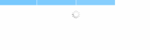</img></td>
</tr>
<tr align="center" height="120px">
  <td>ReplicatorWoody</td>
  <td>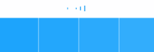</img></td>
  <td>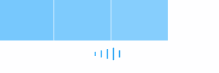</img></td>
</tr>
<tr align="center" height="120px">
  <td>ReplicatorAllen</td>
  <td></img></td>
  <td>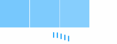</img></td>
</tr>
<tr align="center" height="120px">
  <td>ReplicatorCircle</td>
  <td></img></td>
  <td>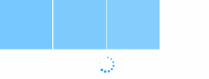</img></td>
</tr>
<tr align="center" height="120px">
  <td>ReplicatorDot</td>
  <td></img></td>
  <td>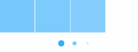</img></td>
</tr>
<tr align="center" height="120px">
  <td>ReplicatorArc</td>
  <td></img></td>
  <td>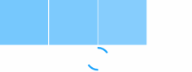</img></td>
</tr>
<tr align="center" height="120px">
  <td>ReplicatorTriangle</td>
  <td></img></td>
  <td>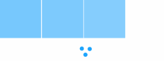</img></td>
</tr>
<tr align="center" height="120px">
  <td>AnimatableRing</td>
  <td></img></td>
  <td>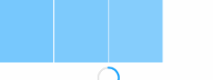</img></td>
</tr>
<tr align="center" height="120px">
  <td>AnimatableArrow</td>
  <td>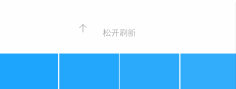</img></td>
  <td>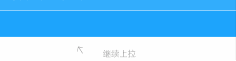</img></td>
</tr>
</table>
 
### Features

*  **Built-in rich animation style, support self-customization** 


* **Non-refresh state hidden automatically** 

  >  To avoid developers manually adjust contentInset refresh the appearance of the control after the impact of the visual experience;</br>
  the most common situation, the absence of data, the bottom of the refresh control is not hidden, the use of KafkaRefresh to avoid the problem.

* **Anti-dithering at the end of the refresh** 

  >When the refresh control finishes refreshing, if UIScrollView is in a scrolling state, KafkaRefresh will adjust the contntOffset that controls the UIScrollView at this time according to the refresh control.

* **Support setting the offset threshold to trigger refresh** 

  >Setting the value of `stretchOffsetYAxisThreshold` can control the refresh pull distance.This property is a ratio relative to the height of the control and must be set greater than 1.0.

* **Support global setting** 

  >KafkaRefreshDefaults is a singleton for global settings

* **Support progress callback** 

  >Real-time callback Drag the offset ratio, for the expansion of the interface, according to the progress of adjustment animation.

* **Adaptive contentInset system adjustment and manual adjustment** 

  >Adaptive UINavigationController for UIScrollView's contentInset property adjustment, even if the contentInset automatically set value, then KafkaRefresh can still adapt this adjustment.

* **Solve the section view floating problem when refreshing** 

* **Support horizontal and vertical screen switching adaptive** 

  >No need to consider in the horizontal and vertical screen refresh refresh problem.

* **iOS 7+**  

  Support iOS 7 above system. Including iPhone X.

* Support auto refresh

  When the user slides the scrollview to the bottom, the refresh will be triggered automatically, without the user having to slide to the bottom and pull up the scrollview. This feature is not enabled by default, because most people will use the function without viewing the document. If it is not used correctly, it will be easy to cause the refresh to stop.

  Use the preload feature, please strictly follow the requirements below:

  * ```self.tableView.footRefreshControl.autoRefreshOnFoot = YES;``` please set autoRefreshOnFoot TRUE；

  * in refreshHandler，Strictly follow the logic below！

    ```objective-c
     if ({No data needs to be stitched}) {
         [weakSelf.tableView.footRefreshControl endRefreshingAndNoLongerRefreshingWithAlertText:@"no more"];
     } else {
         [weakSelf.tableView.footRefreshControl endRefreshingWithAlertText:@"did load successfully" completion:nil];
     }
    ```

* **Document coverage 100%** 

  > You can see the use of all methods and classes in the header file.


### Installation 
* CocoaPods
```ruby
pod 'KafkaRefresh'
```

* Carthage 

> If anyone wants to install by *carthage* , please supply a pull request. I'm not using this package manager myself.

### Usage

```objective-c
 #import "KafkaRefresh.h" 
```

##### Initialization
* The first way
```objective-c
#pragma mark - head

[self.tableView bindHeadRefreshHandler:^{
        
    } themeColor:MainColor refreshStyle:KafkaRefreshStyleAnimatableArrow];

#pragma mark - foot

[self.tableView bindFootRefreshHandler:^{
        
    } themeColor:MainColor refreshStyle:KafkaRefreshStyleAnimatableArrow]; 

#pragma mark - auto refresh

self.tableView.footRefreshControl.autoRefreshOnFoot = YES;
```
* The second way
```objective-c
 KafkaArrowHeader * arrow = [[KafkaArrowHeader alloc] init];
 arrow.refreshHandler = ^{
	 //to do something... 
 };
 self.tableView.headRefreshControl = arrow;
```
* The third way(global configuration)
```objective-c
- (BOOL)application:(UIApplication *)application didFinishLaunchingWithOptions:(NSDictionary *)launchOptions {
	[[KafkaRefreshDefaults standardRefreshDefaults] setHeaderDefaultStyle:KafkaRefreshStyleAnimatableRing];
	return YES;
}

#pragma mark - global

[self.tableView bindGlobalStyleForFootRefreshHandler:^{
        
}];
```
##### Trigger Refresh Manually

```objective-c
 [self.tableView.headRefreshControl beginRefreshing];
 [self.tableView.footRefreshControl beginRefreshing];
```

##### End Refresh
> When you finish refreshing and don't need to show any hints, or any animation, call the following method.

```objective-c
- (void)endRefreshing; 
```
> When you finish the refresh and need to display the prompt message, call the following method.

```objective-c
- (void)endRefreshingWithAlertText:(NSString *)text completion:(dispatch_block_t)completion; 
```

>When you end the refresh and no longer need to refresh, call the following method.

```objective-c
- (void)endRefreshingAndNoLongerRefreshingWithAlertText:(NSString *)text;
```
##### Resume Refresh Available
```objective-c
/**
 After you call ‘endRefreshingAndNoLongerRefreshingWithAlertText’,
 you need to resume refresh available
 */
- (void)resumeRefreshAvailable;
```

### Customize

Take KafkaheadRefreshControl as an example
```objective-c
 #import "KafkaheadRefreshControl.h"
 @interface CustomHeader : KafkafootRefreshControl
 @end
```

 ```objective-c
 @implementation CustomHeader 

- (void)kafkaDidScrollWithProgress:(CGFloat)progress max:(const CGFloat)max{
	//progress callback
}

- (void)kafkaRefreshStateDidChange:(KafkaRefreshState)state{
	[super kafkaRefreshStateDidChange:state];
}
@end
 ```
### Warnings And Precautions 

* Many people asked me a question that tableView jump after called `insertRowAtIndexPath: withRowAnimation:`,That Is Not Bug Of KafkaRefresh. Setting `tableView.estimatedRowHeight = UITableViewAutomaticDimension;` can solve this question when you initialize tableView;


* Please update the latest version!


### Communication
> 1. If you need help，please email <xorshine@icloud.com>.
> 2. If you found a bug，and can provide steps to reliably reproduce it, open an issue.
> 3. Personal energy is limited, Kafka provides callback interface enough to increase the richer UI effect, we welcome you to join together and submit the pull request.  


### License
> KafkaRefresh is released under the MIT license. See [LICENSE](https://github.com/xorshine/KafkaRefresh/blob/master/LICENSE) for details.


[](https://app.fossa.com/projects/git%2Bgithub.com%2FHHHsiang%2FKafkaRefresh?ref=badge_large)